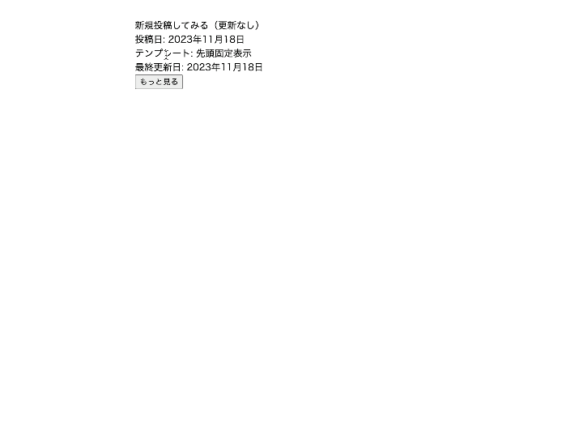

## やりたいこと
- 投稿済記事を「もっと見るボタン」が押下されたら、非同期処理で1件ずつ取得
- 取得した記事は表示済み記事の下、追加して表示
- 最初の状態では投稿記事は1件のみ表示
- 投稿記事の並び順は更新日（投稿日）順にソート
- 表示する記事がこれ以上ない場合は「もっと見るボタン」を非表示
- 非同期処理で記事取得中は「もっと見るボタン」を非活性化

## 期待結果


## フォルダ構成
```
theme/
  ├ css/
    └ top.css
  ├ js/
    └ loadmore.js
  ├ functions.php
  ├ index.php
  └ style.css
```

## コード概要

### index.php
```php
<!DOCTYPE html>
<html lang="en">
<?php wp_head(); ?>
<body>
<?php
// WP_Queryを使用して最初の6件の投稿を取得
$args = array(
    'posts_per_page' => 1,
    'order'=>'DESC',
 		'orderby'=>'modified'
);
$query = new WP_Query($args);

// ループ開始
if ($query->have_posts()) :
    while ($query->have_posts()) :
        $query->the_post();
        $post_date = get_the_date();
        $modified_date = get_the_modified_date();
        // 投稿の表示内容
        if ($post_date != $modified_date) {
          // 最終更新日を表示
          echo "<div>".get_the_title()."</div>";
          echo '最終更新日: ' . $modified_date;
        } else {
            // 投稿日を表示
            echo "<div>".get_the_title()."</div>";
            echo '投稿日: ' . $post_date . "<br>";
        }
    endwhile;
endif;
// ループ終了
wp_reset_postdata();
?>
<button id="loadmore">もっと見る</button>
</body>
</html>
```

### functions.php
```php
<?php

function my_theme_scripts() {
  wp_enqueue_style('my_css', get_template_directory_uri() . '/css/top.css');
  wp_enqueue_script('my_loadmore', get_template_directory_uri() . '/js/loadmore.js', array('jquery'));
  // ローカル変数をJavaScriptに渡す
  wp_localize_script('my_loadmore', 'my_ajax_object', array(
    'ajax_url' => admin_url('admin-ajax.php'),
));
}

add_action('wp_enqueue_scripts', 'my_theme_scripts');


function loadmore_ajax_handler(){
  $offset = $_POST['offset'];
  $args = array(
    'posts_per_page' => 1,
    'order'=>'DESC',
    'orderby'=>'modified',
    'offset' => $offset + 1
  );

  query_posts( $args );
  if( have_posts() ) :
      while( have_posts() ):
        the_post();
        $post_date = get_the_date();
        $modified_date = get_the_modified_date();
        // 投稿の表示内容
        if ($post_date != $modified_date) {
          // 最終更新日を表示
          echo "<div>".get_the_title()."</div>";
          echo '最終更新日: ' . $modified_date. "<br>";
        } else {
            // 投稿日を表示
            echo "<div>".get_the_title()."</div>";
            echo '投稿日: ' . $post_date . "<br>";
        }
      endwhile;
  endif;
  die;
}
add_action('wp_ajax_loadmore', 'loadmore_ajax_handler');
add_action('wp_ajax_nopriv_loadmore', 'loadmore_ajax_handler');
```

### js/loadmore.js
```javascript
jQuery(function($){
  let offset = 1;
  $('#loadmore').on('click', function() {
    $(this).addClass("loading");
    const $that = $(this);
    $.ajax({
        url : my_ajax_object.ajax_url,
        data : {
            'action': 'loadmore',
            'offset' : offset
        },
        type : 'POST',
        success : function( data ){
            if(data) {
                $that.before(data); // 投稿を挿入
                offset++;
                $that.removeClass("loading");
            } else {
                $that.hide(); // ボタンを隠す
            }
        }
    });
    return false;
  });
});
```

### css/top.css
```css
.loading {
  pointer-events:none;
  opacity: 0.5;
}
```

## 参考記事
- https://stackoverflow.com/questions/58764925/create-loadmore-for-wordpress-with-ajax-and-custom-post-type
- https://y-hilite.com/1648/
- https://teratail.com/questions/245536